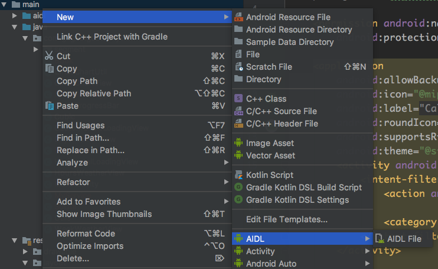

### Android AIDL及Binder

##### IPC

inter-process Commnication跨进程的通信，Android一般情况下一个应用是默认运行在一个进程中，但有可能一个应用中需要采用多进程模式来实现(比如获取多份内存空间），或者两个应用之间需要获取彼此之间的数据，还有AMS（系统服务）对每个应用中四大组件的管理，系统服务是运行在一个单独的进程中，这些都需要IPC。IPC主要包含的基础概念内容为Serializable接口，Parcelable接口及Binder。

##### Serializable接口

java提供的序列化接口，使用时只需要实现Serializable接口并声明一个serialVersionUID，接口是一个空实现。

##### Parcelable接口

Parcelable是Android中的序列化方式，使用起来麻烦一点，但是效率很高，是Android推荐的方式。

两者都可以实现序列化并可用于intent间的数据传递，Serializable使用简单，但是开销很大，Parcelable是Android中的序列化方式，效率很高，是Android推荐的方式。Parcelable主要用在内存序列化上，如果**要将对象序列化到存储设备或者通过网络传输**也是可以的，但是会比较复杂，这两种情况建议使用Serializable。

##### Binder

 直观来说，Binder是Android中的一个类，它继承了IBinder接口

从IPC角度来说，Binder是Android中的一种跨进程通信方式，Binder还可以理解为一种虚拟的物理设备，它的设备驱动是/dev/binder，该通信方式在linux中没有

从Android Framework角度来说，Binder是ServiceManager连接各种Manager（ActivityManager、WindowManager）和相应ManagerService的桥梁

从Android应用层来说，Binder是客户端和服务端进行通信的媒介，当你bindService的时候，服务端会返回一个包含了服务端业务调用的Binder对象，通过这个Binder对象，客户端就可以获取服务端提供的服务或者数据，这里的服务包括普通服务和基于AIDL的服务

##### AIDL简单使用

1.创建aidl文件



创建完成后，系统会默认生成一个aidl接口文件，内部方法会展示aidl支持的基本数据类型，不需要关心，如果不需要的话直接删掉就好。此时aidl包下的包名是与主包一致的。为了演示的全面，采用自定义的对象。

2.在java包创建类,实现Parcelable接口（因为需要跨进程通信）

```java
public class Book implements Parcelable {

    public int bookId;
    public String bookName;

    public Book(int bookId, String bookName) {
        this.bookId = bookId;
        this.bookName = bookName;
    }

    @Override
    public int describeContents() {
        return 0;
    }

    @Override
    public void writeToParcel(Parcel dest, int flags) {
        dest.writeInt(this.bookId);
        dest.writeString(this.bookName);
    }

    protected Book(Parcel in) {
        this.bookId = in.readInt();
        this.bookName = in.readString();
    }

    public static final Parcelable.Creator<Book> CREATOR = new Parcelable.Creator<Book>() {
        @Override
        public Book createFromParcel(Parcel source) {
            return new Book(source);
        }

        @Override
        public Book[] newArray(int size) {
            return new Book[size];
        }
    };
}

```

3.在aidl的包下创建同名的Book.aidl类文件，并标明parcelable

```java
package com.gagobigdata.myview;
parcelable Book;//注意这里一定要用parcelable关键字声明，与java类实现Parcelable接口一样的效果，这里没有具体实现
```

4.建立IBookManager.aidl接口

```java
// IBookManager.aidl
package com.gagobigdata.myview;

// Declare any non-default types here with import statements
import com.gagobigdata.myview.Book;//注意这里一定要手动导入类文件，在aidl的语法中，哪怕在同一包下也需要手动导入。

interface IBookManager {
    List<Book> getBookList();
    void addBook(in Book book);//这里需要声明参数类型，否者会编译失败，in为输入型 out为输出型 inout为输入输出型
}
```

建立完成后同步一下项目，在app->build->generated->source下会生成同名接口文件，整理格式后如下

```java
public interface IBookManager extends android.os.IInterface {
    /**
     * Local-side IPC implementation stub class.
     */
    public static abstract class Stub extends android.os.Binder implements com.gagobigdata.myview.IBookManager {
        private static final java.lang.String DESCRIPTOR = "com.gagobigdata.myview.IBookManager";

        /**
         * Construct the stub at attach it to the interface.
         */
        public Stub() {
            this.attachInterface(this, DESCRIPTOR);
        }

        /**
         * Cast an IBinder object into an com.gagobigdata.myview.IBookManager interface,
         * generating a proxy if needed.
         */
        public static com.gagobigdata.myview.IBookManager asInterface(android.os.IBinder obj) {
            if ((obj == null)) {
                return null;
            }
            android.os.IInterface iin = obj.queryLocalInterface(DESCRIPTOR);
            if (((iin != null) && (iin instanceof com.gagobigdata.myview.IBookManager))) {
                return ((com.gagobigdata.myview.IBookManager) iin);
            }
            return new com.gagobigdata.myview.IBookManager.Stub.Proxy(obj);
        }

        @Override
        public android.os.IBinder asBinder() {
            return this;
        }

        @Override
        public boolean onTransact(int code, android.os.Parcel data, android.os.Parcel reply, int flags) throws android.os.RemoteException {
            switch (code) {
                case INTERFACE_TRANSACTION: {
                    reply.writeString(DESCRIPTOR);
                    return true;
                }
                case TRANSACTION_getBookList: {
                    data.enforceInterface(DESCRIPTOR);
                    java.util.List<com.gagobigdata.myview.Book> _result = this.getBookList();
                    reply.writeNoException();
                    reply.writeTypedList(_result);
                    return true;
                }
                case TRANSACTION_addBook: {
                    data.enforceInterface(DESCRIPTOR);
                    com.gagobigdata.myview.Book _arg0;
                    if ((0 != data.readInt())) {
                        _arg0 = com.gagobigdata.myview.Book.CREATOR.createFromParcel(data);
                    } else {
                        _arg0 = null;
                    }
                    this.addBook(_arg0);
                    reply.writeNoException();
                    return true;
                }
            }
            return super.onTransact(code, data, reply, flags);
        }

        private static class Proxy implements com.gagobigdata.myview.IBookManager {
            private android.os.IBinder mRemote;

            Proxy(android.os.IBinder remote) {
                mRemote = remote;
            }

            @Override
            public android.os.IBinder asBinder() {
                return mRemote;
            }

            public java.lang.String getInterfaceDescriptor() {
                return DESCRIPTOR;
            }

            @Override
            public java.util.List<com.gagobigdata.myview.Book> getBookList() throws android.os.RemoteException {
                android.os.Parcel _data = android.os.Parcel.obtain();
                android.os.Parcel _reply = android.os.Parcel.obtain();
                java.util.List<com.gagobigdata.myview.Book> _result;
                try {
                    _data.writeInterfaceToken(DESCRIPTOR);
                    mRemote.transact(Stub.TRANSACTION_getBookList, _data, _reply, 0);
                    _reply.readException();
                    _result = _reply.createTypedArrayList(com.gagobigdata.myview.Book.CREATOR);
                } finally {
                    _reply.recycle();
                    _data.recycle();
                }
                return _result;
            }

            @Override
            public void addBook(com.gagobigdata.myview.Book book) throws android.os.RemoteException {
                android.os.Parcel _data = android.os.Parcel.obtain();
                android.os.Parcel _reply = android.os.Parcel.obtain();
                try {
                    _data.writeInterfaceToken(DESCRIPTOR);
                    if ((book != null)) {
                        _data.writeInt(1);
                        book.writeToParcel(_data, 0);
                    } else {
                        _data.writeInt(0);
                    }
                    mRemote.transact(Stub.TRANSACTION_addBook, _data, _reply, 0);
                    _reply.readException();
                } finally {
                    _reply.recycle();
                    _data.recycle();
                }
            }
        }

        static final int TRANSACTION_getBookList = (android.os.IBinder.FIRST_CALL_TRANSACTION + 0);
        static final int TRANSACTION_addBook = (android.os.IBinder.FIRST_CALL_TRANSACTION + 1);
    }

    public java.util.List<com.gagobigdata.myview.Book> getBookList() throws android.os.RemoteException;

    public void addBook(com.gagobigdata.myview.Book book) throws android.os.RemoteException;
}

```

5.创建本地服务并注册

```java
public class MyService extends Service {

    private CopyOnWriteArrayList<Book> mBookList;

    @Override
    public void onCreate() {
        super.onCreate();
        mBookList = new CopyOnWriteArrayList<>();
        mBookList.add(new Book(1, "Android"));
        mBookList.add(new Book(2, "iOS"));
    }

    public MyService() {
    }

    @Override
    public IBinder onBind(Intent intent) {
        return new MyBinder();
    }

    class MyBinder extends IBookManager.Stub {

        @Override
        public List<Book> getBookList() throws RemoteException {
            return mBookList;
        }

        @Override
        public void addBook(Book book) throws RemoteException {
            if (mBookList != null && !mBookList.contains(book)) {
                mBookList.add(book);
            }
        }
    }

    @Override
    public void onDestroy() {
        super.onDestroy();
    }
}

```

```xml
		<service
            android:name=".MyService"
            android:enabled="true"
            android:exported="true">
            <intent-filter>
                <action android:name="com.gagobigdata.myview.MyService"/>
            </intent-filter>
        </service>
```

需要注意的是，由于跨进程，在不同应用中需要隐式启动该服务，所以需要暴露给外部访问。

6.新建客户端项目，将服务端项目中的aidl文件夹全部拷贝进客户端项目，包括我们需要传输的自定义的java类，否则会报错，然后启动服务端的服务就可以实现跨进程的通信。以下给出activity的代码

```java
public class MainActivity extends AppCompatActivity {

    private IBookManager bookManager;

    private ServiceConnection connection = new ServiceConnection() {
        @Override
        public void onServiceConnected(ComponentName name, IBinder service) {
            bookManager = IBookManager.Stub.asInterface(service);
            List<Book> bookList;
            try {
                bookList= bookManager.getBookList();
                Log.d("MainActivity",bookList.toString());
                bookManager.addBook(new Book(3,"Flutter"));
                bookList= bookManager.getBookList();
                Log.d("MainActivity",bookList.toString());
                bookManager.registerListener(mListener);
            } catch (RemoteException e) {
                e.printStackTrace();
            }
        }

        @Override
        public void onServiceDisconnected(ComponentName name) {
            bookManager = null;
        }
    };

    @Override
    protected void onCreate(Bundle savedInstanceState) {
        super.onCreate(savedInstanceState);
        setContentView(R.layout.activity_main);
        Intent intent = new Intent();
        intent.setAction("com.gagobigdata.myview.MyService");
        intent.setPackage("com.gagobigdata.myview");
        bindService(intent,connection,BIND_AUTO_CREATE);
    }

    @Override
    protected void onDestroy() {
        super.onDestroy();

        if (bookManager != null && bookManager.asBinder().isBinderAlive()) {
            try {
                bookManager.unRegisterListener(mListener);
            } catch (RemoteException e) {
                e.printStackTrace();
            }
        }
        unbindService(connection);
    }
}
```

到这里跨进程就完成了。