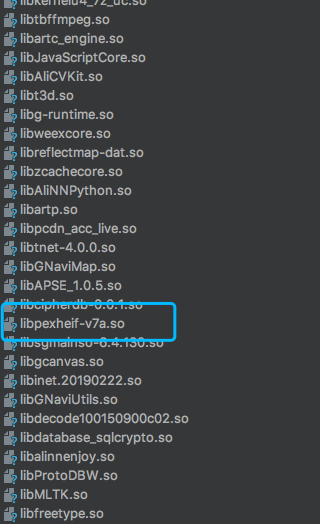

### Android手机CPU版本及SO库兼容

#### CPU

CPU 即中央处理器，主要用来处理一些计算密集型的任务。而且单个 CPU 可以同时进行多个任务，多个任务实际上并不是真的同时执行，要靠 CPU 高速调度几个任务，顺序执行，只是速度太快，我们感觉是在同时执行，但是多任务之间调度会影响到性能。随着技术飞速发展，出现了多核心 CPU，其实 CPU 主要就是靠得核心在工作，多个核心即可实现真正意义上的同时处理任务。

#### 核心

核心的实现方式被称为微架构（microarchitecture）。指令集是一套规范，是公开的，指令集的实现（微架构）是一个极具技术含量的工作，而且即便是你有这个技术，你想设计某套指令集的微架构，还需要得到该指令集的授权，否则会吃官司。而微架构的设计直接影响了核心可以达到的最高频率、核心在一定频率下能执行的运算量、一定工艺水平下核心的能耗水平等等，也就是微架构设计技术的好坏，决定了设计出核心性能的高低。

#### ABI

[ABI](https://link.jianshu.com/?t=https%3A%2F%2Fdeveloper.android.google.cn%2Fndk%2Fguides%2Fabis.html) 是应用程序二进制接口（Application Binary Interface），说明它也是一种规范，有点类似指令集的概率。不同 Android 手机使用不同的 CPU，因此支持不同的指令集。CPU 与指令集的每种组合都有其自己的应用二进制界面（或 *ABI*）， ABI 可以非常精确地定义应用的机器代码在运行时如何与系统交互。目前 Android 平台主流的有：`armeabi`、`armeabi-v7a`、`x86`、`mips`、`arm64-v8a`、`mips64`、`x86_64`。

#### Android下ABI兼容

armeabi设备只兼容armeabi； 

armeabi-v7a设备兼容armeabi-v7a、armeabi； 

arm64-v8a设备兼容arm64-v8a、armeabi-v7a、armeabi； 

X86设备兼容X86、armeabi； X86_64设备兼容X86_64、X86、armeabi； 

mips64设备兼容mips64、mips； mips只兼容mips；

armeabi基本可以兼容所有版本的CPU。它能运行在除了mips和mips64的设备上，但在非armeabi设备上运行性能还是有所损耗。当一个应用安装在设备上，只有该设备支持的CPU架构对应的.so文件会被安装。在x86设备上，libs/x86目录中如果存在.so文件的话，会被安装，如果不存在，则会选择armeabi-v7a中的.so文件，如果也不存在，则选择armeabi目录中的.so文件（因为x86设备也支持armeabi-v7a和armeabi）。

从目前移动端CPU市场的份额数据看，ARM架构几乎垄断，所以，除非你的用户很特殊，否则几乎可以不考虑单独编译带入X86、X86_64、mips、mips64架构SO文件。除去这四个架构之后，还要带入armeabi、armeabi-v7a、arm64-v8a这三个不同类型，这对于一个拥有大量SO文件的应用来说，安装包的体积将会增大不少。针对以上情况，我们可以分析应用的设备分布和市场情况再进行取舍斟酌，**如果你的应用仍有不少armeabi类型的设备**，**可以考虑只保留armeabi目录下的SO文件**。但是，尽管armeabi可以兼容多种平台，仍有些运算在armeabi-v7a、arm64-v8a，去使用armeabi的SO文件时，性能会非常差强人意，所以还是应该用其对应平台架构的SO文件进行运算。

Android获取手机abi

```java
String[] abis = Build.SUPPORTED_ABIS;//获取兼容的abi数组，越靠前的元素性能越优秀
String abi = Build.CPU_ABI;//获取最优的兼容库
```

大厂.so的处理一般也是只保留armeabi一个文件夹下的so库，但是在armeabi文件夹下会放入v5、v7a架构的SO文件，用于处理兼容带来的某些性能运算问题。

例如淘宝的armeabi文件夹



就目前市场，绝大部分的设备都是armeabi-v7a、arm64-v8a，也可以考虑只保留armeabi-v7a架构的SO文件，这样能获得更好的性能效果。性能差异比较明显的加入单个的so文件并在代码中去判断。

以上方案的大只步骤如下：

1.只保留armeabi目录，将armeabi-v7a（或者其他abi类型）下so拷贝到armeabi并重命名。

2.构建方式指定需要类型的SO库，即只有armeabi

3.封装自定义实现loadLibrary方法，通过判断设备的CPU类型来决定使用armeabi-v7a的so还是armeabi的so

4.将程序中调用System.loadLibrary的方法改为自定义的方法。

```java
public class SoUtil {

    public static final String ARM_V7A = "armeabi-v7a";
    public static final String ARM7_EXTRA_PATH = "_v7";

    /**
     * 根据cpu类型加载so文件，如果是armeabi-v7a类型，加载armeabi-v7a类型的so，其他cpu加载arm类型的cpu
     *
     * @param soName
     */
    @RequiresApi(api = Build.VERSION_CODES.LOLLIPOP)
    public static void loadLibrary(String soName) {
        if (isABIArm7(getSupportABI())) {
            System.loadLibrary(soName + ARM7_EXTRA_PATH);
        } else {
            System.loadLibrary(soName);
        }
    }

    /**
     * 获取cpu类型
     *
     * @return
     */
    @RequiresApi(api = Build.VERSION_CODES.LOLLIPOP)
    public static String getSupportABI() {

        String[] abis = Build.SUPPORTED_ABIS;
        if (abis != null && abis.length > 0) {
            return abis[0];
        }
        return Build.CPU_ABI;
    }

    /**
     * 判断cpu是否是armeabi-v7a
     *
     * @param abi
     * @return
     */
    public static boolean isABIArm7(String abi) {
        if (abi != null && abi.contains(ARM_V7A)) {
            return true;
        }
        return false;
    }

}
```

#### SO可能遇到的错误

如果你打算只使用一个文件夹的话，那么需要就需要注意你引入的第三方库，比如你引入的某一个第三方库中支持armeabi、armeabi-v7a、x86、arm64-v8a、x86_64，而你的项目中只有armeabi，那么就可能会出现crash，因此需要在build.gradle配置ndk.filter

```groovy
defaultConfig {  
    ndk {  
        abiFilters "armeabi"// 指定ndk需要兼容的ABI(这样其他依赖包里x86,armeabi,arm-v8之类的so会被过滤掉) 
    }  
}  
```

目前国内的大厂app中，微信，淘宝及京东都只采用了armeabi一个文件夹，但是微信和淘宝中支持了动态选择v7，v4等so库，京东不支持。国外的Facebook和Twitter只使用了armeabi-v7a。