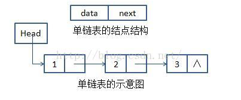
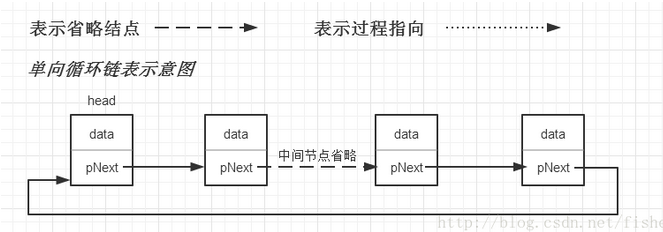
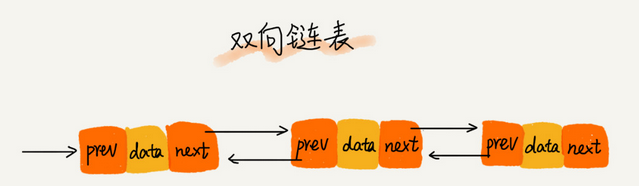
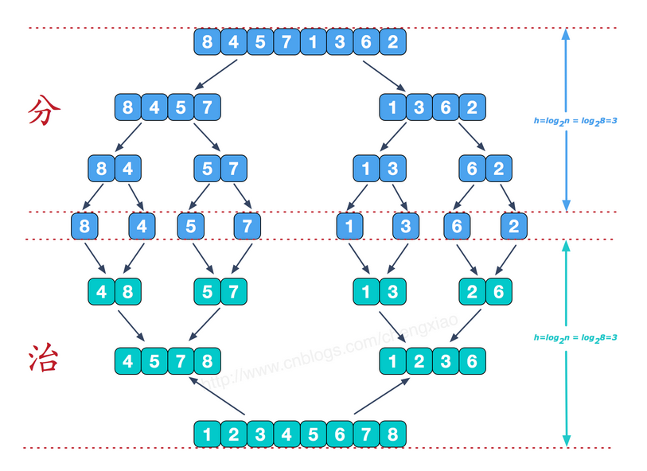
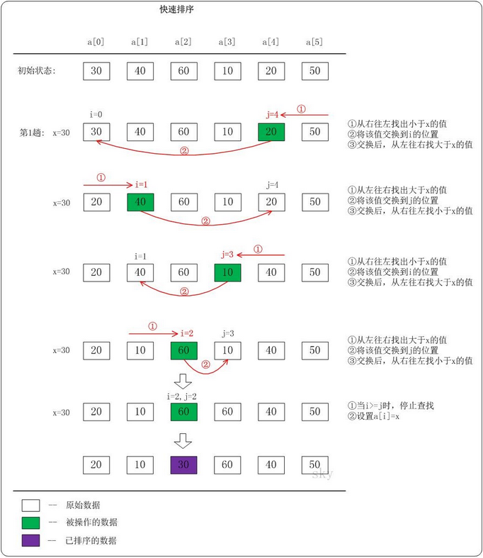

### 数组

数组（Array）是一种线性表数据结构。它用一组连续的内存空间，来存储一组具有相同类型的数据。

#### 线性表

线性表是数据排成像一条线一样的结构。每个线性表上的数据最多只有前和后两个方向，包括链表、队列、栈等。

与之相对立的是非线性表，例如二叉树、堆、图等；他们的数据之间不只有简单的前后关系。

#### 连续的内存空间和相同类型的数据

有了这个特性，才能有数组的随机访问的特性，但同时也造就了数据的插入删除操作的低效，因为必须要保证数据的连续性，就必须要做大量的数据搬移操作

数组的随机访问计算

a[i]_address = base_address + i * data_type_size

#### ArrayList

数组是不支持动态扩容的，ArrayList相比数组的优势就是将数组的很多操作细节都封装了，例如数据的插入删除操作时需要数据的搬移操作；ArrayList支持动态扩容，当空间不足的时候会自动扩容1.5倍，但中间会涉及内存的申请及数据的搬移，所以会比较耗时，所以如果事先能确定需要存储的数据大小，最好在创建的时候事先指定ArrayList的大小。

有优点就会有缺点，ArrayList不能存储基本类型，需要封装为Integer、Long，拆箱和装箱也是耗时的，性能方面会低于数组。在表示多维数组时，数组会比较直观。

ArrayList的扩容机制

```java
private void grow(int minCapacity) {
    // overflow-conscious code
    int oldCapacity = elementData.length;
    int newCapacity = oldCapacity + (oldCapacity >> 1);
    if (newCapacity - minCapacity < 0)
        newCapacity = minCapacity;
    if (newCapacity - MAX_ARRAY_SIZE > 0)
        newCapacity = hugeCapacity(minCapacity);
    // minCapacity is usually close to size, so this is a win:
    elementData = Arrays.copyOf(elementData, newCapacity);
}

扩容机制为首先扩容为原始容量的 1.5 倍。如果1.5倍太小的话，则将我们所需的容量大小赋值给 newCapacity，如果1.5倍太大或者我们需要的容量太大，那就直接拿 newCapacity = (minCapacity > MAX_ARRAY_SIZE) ? Integer.MAX_VALUE : MAX_ARRAY_SIZE 来扩容。 扩容之后是通过数组的拷贝来确保元素的准确性的，所以尽可能减少扩容操作。 ArrayList 的最大存储能力：Integer.MAX_VALUE。
```

#### 数组下标为什么要从零开始

正常的数组下标计算方式

a[k]_address = base_address + k * type_size

如果数组下标从1开始

a[k]_address = base_address + (k-1)*type_size

相比之下，从1开始的计算在CPU中会多进行一次运算，对于最基础的数据类型，性能是最重要的。

还有就是历史原因，C语言设计之初就是从0开始，后来的语言很多都是给予C语言的。

### 链表

链表是通过指针将一组零散的内存串联起来使用。

#### 单链表

单链表每个节点中出了存储数据意外，还有额外的存储一个指向下一个节点的指针数据，通常称为后继指针next，链表中有两个比较特殊的节点，即头节点和尾节点，头节点记录了链表的基地址，有了它，我们可以遍历得到真个链表，尾节点并不是指向下一个节点，而是指向的空地址，表示链表的最后一个节点。



链表也支持数据的插入删除，相对数组来说，链表的插入和删除是很快速的，因为链表的的内存本来就不是连续的，在插入或者删除的时候仅仅需要改变指针的指向即可，但有利就有弊，链表的随机访问就显的很慢，它不能通过寻址公式计算内存地址，需要遍历每一个内存地址，直到找到对应的数据节点

```java
public class Node {
     protected Node next; //指针
     public  int data;//数据  
       
     public Node( int data) {  
           this. data = data;  
     }  
       
     //显示此节点  
     public void display() {  
          System. out.print( data + " ");  
     }  
}

public class LinkList {
    public Node first; // 定义一个头结点
    private int pos = 0;// 节点的位置

    public LinkList() {
        this.first = null;
    }

    // 插入一个头节点
    public void addFirstNode(int data) {
        Node node = new Node(data);
        node.next = first;
        first = node;
    }

    // 删除一个头结点,并返回头结点
    public Node deleteFirstNode() {
        Node tempNode = first;
        first = tempNode.next;
        return tempNode;
    }

    // 在任意位置插入节点 在index的后面插入
    public void add(int index, int data) {
        Node node = new Node(data);
        Node current = first;
        Node previous = first;
        while (pos != index) {
            previous = current;
            current = current.next;
            pos++;
        }
        node.next = current;
        previous.next = node;
        pos = 0;
    }

    // 删除任意位置的节点
    public Node deleteByPos(int index) {
        Node current = first;
        Node previous = first;
        while (pos != index) {
            pos++;
            previous = current;
            current = current.next;
        }
        if (current == first) {
            first = first.next;
        } else {
            pos = 0;
            previous.next = current.next;
        }
        return current;
    }

    // 根据节点的data删除节点(仅仅删除第一个)
    public Node deleteByData(int data) {
        Node current = first;
        Node previous = first; // 记住上一个节点
        while (current.data != data) {
            if (current.next == null) {
                return null;
            }
            previous = current;
            current = current.next;
        }
        if (current == first) {
            first = first.next;
        } else {
            previous.next = current.next;
        }
        return current;
    }

    // 显示出所有的节点信息
    public void displayAllNodes() {
        Node current = first;
        while (current != null) {
            current.display();
            current = current.next;
        }
        System.out.println();
    }

    // 根据位置查找节点信息
    public Node findByPos(int index) {
        Node current = first;
        if (pos != index) {
            current = current.next;
            pos++;
        }
        return current;
    }

    // 根据数据查找节点信息
    public Node findByData(int data) {
        Node current = first;
        while (current.data != data) {
            if (current.next == null)
                return null;
            current = current.next;
        }
        return current;
    }
}


public class TestLinkList {
    public static void main(String[] args) {  
        LinkList linkList = new LinkList();  
        linkList.addFirstNode(20);  
        linkList.addFirstNode(21);  
        linkList.addFirstNode(19);  
         //print19,21,20  
        linkList.add(1, 22); //print19,22,21,20  
        linkList.add(2, 23); //print19,22,23,21,20  
        linkList.add(3, 99); //print19,22,23,99,21,20  
      //调用此方法会print 19,22,23,99,21,20 
        linkList.displayAllNodes();  
        }
}

```


#### 循环链表

循环链表是一种比较特殊的单链表，跟单链表的区别就是尾节点的指针指向的并不是空地址，而是指向头节点。



#### 双向链表

双向链表支持两个方向，它的每一个节点不只有后继指针next，它还有一个前驱指针prev。这个特性就决定了链表能够双向遍历。



对比单链表，双向链表需要占用更多的内存空间来存储前驱节点和后继节点的内存地址，在某些情况下，插入和删除操作要比单链表更高效。

### 栈

栈是一种操作受限的线性表，遵循先进后出，后进先出的原则，它只允许在一端插入和删除数据。栈即可用数组实现，也可以用链表实现，数组实现的的顺序栈，链表实现的叫链式栈

```java
// 基于数组实现的顺序栈
public class ArrayStack {
  private String[] items;  // 数组
  private int count;       // 栈中元素个数
  private int n;           // 栈的大小

  // 初始化数组，申请一个大小为 n 的数组空间
  public ArrayStack(int n) {
    this.items = new String[n];
    this.n = n;
    this.count = 0;
  }

  // 入栈操作
  public boolean push(String item) {
    // 数组空间不够了，直接返回 false，入栈失败。
    if (count == n) return false;
    // 将 item 放到下标为 count 的位置，并且 count 加一
    items[count] = item;
    ++count;
    return true;
  }
  
  // 出栈操作
  public String pop() {
    // 栈为空，则直接返回 null
    if (count == 0) return null;
    // 返回下标为 count-1 的数组元素，并且栈中元素个数 count 减一
    String tmp = items[count-1];
    --count;
    return tmp;
  }
}

```

上面实现的是简单的栈，栈其实对应的是程序里的特殊应用场景而产生的一种数据结构。它不需要复杂的数据操作。比较经典的是函数调用栈，浏览器的返回页，以及表达式求值。

34+13*9+44-12/3

上面的求值就是利用两个栈来实现的，一个保存数，一个保存运算符。遍历表达式，遇到数字直接压入数字栈，当遇到运算符，就与运算符栈的栈顶元素进行比较，如果比栈顶元素的优先级高，则在数字栈中取出栈顶的两个数组进行计算，在把计算结果压入数字栈，继续比较。

### 队列

与栈类似，也是一种受限的线性表数据结构，也只支持入和出，与栈不同的是队列遵循的是先进先出的原则。按底层实现来分有顺序队列，链式队列等，还有一些特殊特性的队列例如循环队列、阻塞队列，并发队列。多用于偏底层系统，框架，中间件的开发

#### 顺序队列

```java
// 用数组实现的队列
public class ArrayQueue {
  // 数组：items，数组大小：n
  private String[] items;
  private int n = 0;
  // head 表示队头下标，tail 表示队尾下标
  private int head = 0;
  private int tail = 0;

  // 申请一个大小为 capacity 的数组
  public ArrayQueue(int capacity) {
    items = new String[capacity];
    n = capacity;
  }

    // 入队操作，将 item 放入队尾
  public boolean enqueue(String item) {
    // tail == n 表示队列末尾没有空间了
    if (tail == n) {
      // tail ==n && head==0，表示整个队列都占满了
      if (head == 0) return false;
      // 数据搬移
      for (int i = head; i < tail; ++i) {
        items[i-head] = items[i];
      }
      // 搬移完之后重新更新 head 和 tail
      tail -= head;
      head = 0;
    }
    
    items[tail] = item;
    ++tail;
    return true;
  }


  // 出队
  public String dequeue() {
    // 如果 head == tail 表示队列为空
    if (head == tail) return null;
    // 为了让其他语言的同学看的更加明确，把 -- 操作放到单独一行来写了
    String ret = items[head];
    ++head;
    return ret;
  }
}

```

#### 循环队列

循环队列类似一个环，可以避免数据搬移工作

```java
public class CircularQueue {
  // 数组：items，数组大小：n
  private String[] items;
  private int n = 0;
  // head 表示队头下标，tail 表示队尾下标
  private int head = 0;
  private int tail = 0;

  // 申请一个大小为 capacity 的数组
  public CircularQueue(int capacity) {
    items = new String[capacity];
    n = capacity;
  }

  // 入队
  public boolean enqueue(String item) {
    // 队列满了
    if ((tail + 1) % n == head) return false;
    items[tail] = item;
    tail = (tail + 1) % n;
    return true;
  }

  // 出队
  public String dequeue() {
    // 如果 head == tail 表示队列为空
    if (head == tail) return null;
    String ret = items[head];
    head = (head + 1) % n;
    return ret;
  }
}

```

#### 阻塞队列和并发队列

阻塞队列其实就是在队列的基础上增加阻塞操作；当队列为空的时候，从队头取数据会被阻塞，当队列满了，插入数据会被阻塞，直到有空闲位置在插入数据。可以很方便的实现生产者-消费者模型

并发队列其实就是一个线程安全的队列。比较简单的方式就是直接在入队可出队的操作上加锁。

在java中最经典的应用就是线程池

### 递归

例子

看电影问自己的排数

简单的递归公式

f(n) = f(n-1) +1 其中 f(1) = 1

f(n) 表示你想知道你在哪一排，f(n-1) 表示你前面的一排，f(1) = 1表示第一排的人知道自己是第一排，依次得到递归代码

```java
int f(int n) {
  if (n == 1) return 1;
  return f(n-1) + 1;
}
```

递归需要满足3个条件

1.一个问题的解可以分解为几个子问题的解

2.这个问题与分解后的子问题，除了数据规模不同，求解思路完全一样

3.存在递归中止条件

写递归代码最重要的是写出递推公式，找到中止条件

经典面试题

假如有n个台阶，每次你可以跨一个台阶或两个台阶，请问有多少种走法

思路：分为两类，第一类是第一步走了1个台阶，第二类是第一步走了2个台阶，所以n个台阶的走法就等于先走1阶后，n-1个台阶的走法加上先走两阶后，n-2个体台阶的走法，递推公式为

f(n) = f(n-1)+f(n-2)

中止条件为 f(1)=1，f(2)=2

最终代码：

```java
int f(int n) {
  if (n == 1) return 1;
  if (n == 2) return 2;
  return f(n-1) + f(n-2);
}
```

写递归代码的关键是抽象成递归公式

警惕堆栈溢出

### 排序

#### 稳定排序定义

数组中有两个相同的数字，经过某种排序算法排序后，如果这两个相同的数字前后顺序不变的算法叫稳定排序算法，否者是不稳定排序算法

#### 原地排序算法定义

在排序过程中不需要额外的存储空间

#### 冒泡排序

原地排序

稳定排序

时间复杂度 O(n^2)

原理：比较两个相邻的元素，将值大的元素交换至右端。

```java
int[] arr={6,3,8,2,9,1};
for(int i=0;i<arr.length-1;i++){//外层循环控制排序趟数
　　for(int j=0;j<arr.length-1-i;j++){//内层循环控制每一趟排序多少次
　　　　if(arr[j]>arr[j+1]){
　　　　　　int temp=arr[j];
　　　　　　arr[j]=arr[j+1];
　　　　　　arr[j+1]=temp;
　　　　}
　　}
} 
```

#### 插入排序

原地排序

稳定排序

时间复杂度 O(n^2)

原理：将数组分为两个区间，已排序区间和未排序区间，初始已排序区间只有一个元素，取未排序区间的元素在已排序区间找到合适的位置插入，并保证已排序区间一直有序，重复这个过程。

```java
int[] arr={6,3,8,2,9,1};
for(int i = 1; i<arr.length;++i){
    int value = arr[i];
    for(j = i-1; j>=0; --j){
        if(arr[j] > value){
            arr[j+1] = arr[j]];
        } else {
            break;
        }
        arr[j+1] = value;
    }
}
```

#### 选择排序

原地排序

不稳定排序

时间复杂度 O(n^2)

原理：将数组分为两个区间，已排序区间和未排序区间，在未排序区间找到最小的值放入已排序区间的末尾

```java
int[] arr={1,3,2,45,65,33,12};      
        //选择排序的优化
for(int i = 0; i < arr.length - 1; i++) {// 做第i趟排序
    int k = i;
    for(int j = k + 1; j < arr.length; j++){// 选最小的记录
        if(arr[j] < arr[k]){ 
            k = j; //记下目前找到的最小值所在的位置
        }
    }
    //在内层循环结束，也就是找到本轮循环的最小的数以后，再进行交换
    if(i != k){  //交换a[i]和a[k]
        int temp = arr[i];
        arr[i] = arr[k];
        arr[k] = temp;
    }    
}
```

#### 归并排序

非原地算法

稳定排序

时间复杂度O(nlogn)

归并排序（MERGE-SORT）是利用**归并**的思想实现的排序方法，该算法采用经典的**分治**（divide-and-conquer）策略（分治法将问题**分**(divide)成一些小的问题然后递归求解，而**治(conquer)**的阶段则将分的阶段得到的各答案"修补"在一起，即分而治之)。

示意图



代码

```java
    int []arr = {9,8,7,6,5,4,3,2,1};
	sorta(arr);

	public static void sort(int []arr){
    	//在排序前，先建好一个长度等于原数组长度的临时数组，避免递归中频繁开辟空间
        int []temp = new int[arr.length];
        sort(arr,0,arr.length-1,temp);
    }
    private static void sort(int[] arr,int left,int right,int []temp){
        if(left<right){
            int mid = (left+right)/2;
            sort(arr,left,mid,temp);//左边归并排序，使得左子序列有序
            sort(arr,mid+1,right,temp);//右边归并排序，使得右子序列有序
            merge(arr,left,mid,right,temp);//将两个有序子数组合并操作
        }
    }
    private static void merge(int[] arr,int left,int mid,int right,int[] temp){
        int i = left;//左序列指针
        int j = mid+1;//右序列指针
        int t = 0;//临时数组指针
        while (i<=mid && j<=right){
            if(arr[i]<=arr[j]){
                temp[t++] = arr[i++];
            }else {
                temp[t++] = arr[j++];
            }
        }
        while(i<=mid){//将左边剩余元素填充进temp中
            temp[t++] = arr[i++];
        }
        while(j<=right){//将右序列剩余元素填充进temp中
            temp[t++] = arr[j++];
        }
        t = 0;
        //将temp中的元素全部拷贝到原数组中
        while(left <= right){
            arr[left++] = temp[t++];
        }
    }
}
```

#### 快速排序

时间复杂度O(nlogn)

原理：选择一个关键值作为基准值。比基准值小的都在左边序列（一般是无序的），比基准值大的都在右边（一般是无序的）。一般选择序列的第一个元素。

示例图：



代码：

```java
 public class QuickSort{
     public static void main(String args[]){
         QuickSort quicksort = new QuickSort();
         int[] arrays = new int[]{ 1, 12, 2, 13, 3, 14, 4, 15, 5, 16, 17, 17, 177, 18, 8, 8, 19 };
         quicksort.quickSort(arrays);
         System.out.println(Arrays.toString(arrays));
    }
    
    private void quickSort(int[] arrays){
        subQuickSort(arrays, 0, arrays.length - 1);
    }
    
    private void subQuickSort(int[] arrays, int start, int end){
        if (start >= end){
            return;
        }
        int middleIndex = subQuickSortCore(arrays, start, end);
        subQuickSort(arrays, start, middleIndex - 1);
        subQuickSort(arrays, middleIndex + 1, end);
    }
    
    private int subQuickSortCore(int[] arrays, int start, int end){
        int middleValue = arrays[start];
        while (start < end){
            while (arrays[end] >= middleValue && start < end){
                end--;
            }
            arrays[start] = arrays[end];
            while (arrays[start] <= middleValue && start < end){
                start++;
            }
            arrays[end] = arrays[start];
        }
        arrays[start] = middleValue;
        return start;
    }
}
```

